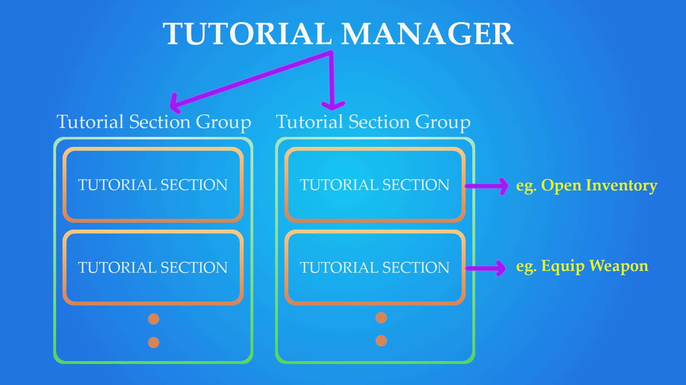
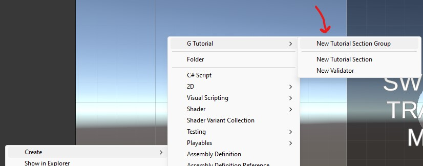
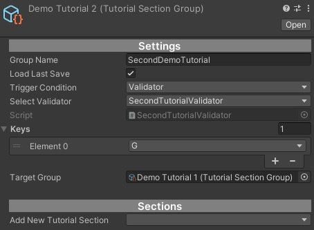

# G-Tutorial-Manager

> A tutorial manager system used in Unity specially casual or hyper-casual, with the aim to be used across all different games without coding or with minimal coding.

> While developing my own hyper-casual games, I realized that I needed a tutorial system. Instead of using a ready-made package, I wanted to develop it myself. I used every update of the system in the new game I developed and took notes on the parts I saw missing. Now that I have developed a Tutorial system that works on its own, I wanted to offer it as a separate package.

## Table of Contents
- [Installation](#installation)
- [System Overview](#system-overview)
- [Scripts Overview](#scripts-overview)
- [Configuration](#configuration)
- [Usage](#usage)
    - [Demo](#demo)
- [License](#license)

## Installation
Import this package into Unity and use it.

## System Overview

## Scripts Overview
The tutorial system mainly consists of 6 core scripts:
- [**TutorialManager**](Assets/G-Tutorial%20Manager/Requirements/TutorialManager.cs): A persistent instance that appears in all scenes, used to create, configure, run and validate tutorials in Editor. Put this in the first scene.
- [**GTutorialSettings**](Assets/G-Tutorial%20Manager/Requirements/GTutorialSettings.cs): It contains Tutorial related settings and all Tutorial Section Groups in your game.
- [**TutorialValidator**](Assets/G-Tutorial%20Manager/Validators/TutorialValidator.cs): A base class that check if the conditions are satisfied to trigger (show) a tutorial. Customized validator should be inherited from this class and implement its own logics. You can add validator to tutorial. If Validator should be true, Tutorial will started. All validators are check once per G Tutorial Settings "scanValidatorsDelayInMs" variable.
- [**TutorialSection**](Assets/G-Tutorial%20Manager/Sections/TutorialSection.cs): It is the smallest unit of structure for a tutorial. It contains when the tutorial starts, when it ends, end condition and Tick. Each tutorial step can be coded with this class.
- [**TutorialSectionGroup**](Assets/G-Tutorial%20Manager/Sections/TutorialSectionGroup.cs): A group of Tutorial Sections. It executes the Tutorial Sections in it step by step. It can be triggered manually or a validator can be added.
- [**TutorialUIController**](Assets/G-Tutorial%20Manager/Requirements/TutorialUIController.cs): An UI panel to show tutorial text, hand, etc. This is only Unity UI compatiable.

## Configuration
Settings of each Tutorial Section Group:
- **Group Name**: A name to save the progress in PlayerPrefs.
- **Load Last Save**: When any Tutorial Section is completed in Tutorial Section Group but Group is not completed, It start from begin when is unchecked. 
- **Trigger Condition**: How the tutorial is triggered (start).
   * Manual: Only trigger mannualy, by calling `TutorialManager.StartTutorial(TutorialSectionGroup)`.
   * Validator: Only trigger when a custom validator script `IsValid()` is `true`.
- **Validator**: Reference to the validator scriptable object. It seems only the trigger condition is Validator.
- **Add New Tutorial Section**: The prefab that contain all tutorial steps and the actually how the tutorial shows to players.

G Tutorial Settings: 
- scanValidatorsDelayInMs: It sets how often the validators are checked.
- AllTutorialGroups: Shows all Tutorial Section Groups in the project.

## Usage

Create a new Tutoral Section with Right click menu.

Apply your settings and that's it! Your tutorial section group is ready!

### Demo
A demo scene is located at [Demo](Assets/Demo/Scenes/DemoScene.unity) folder, open the [DemoScene.unity](Assets/Demo/Scenes/DemoScene.unity) scene and you can see how G-TutorialManager works.

## License
SC Essentials is licensed under a [MIT License](https://github.com/Hot-G/G-Tutorial-Manager/blob/main/LICENSE). 
